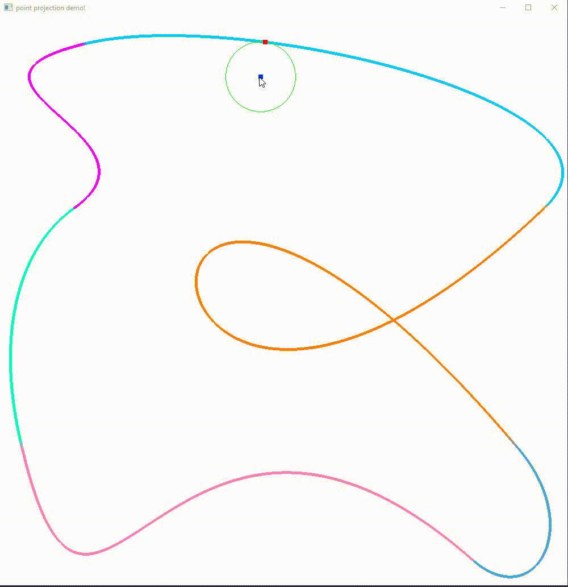

# Point projection library for parametric curves

The library was initially implemented as a concept of presenting a map or a traceable track mathematically for a self-driving car, but it can naturally be used in any graphic application.

To use the library include `ppl/ppl.hpp` in your project.


<br/><br/>

:exclamation: To use the library in sensitive applications, there is no guarantee to achieve specific results, unless you test it enough for your own purposes. **Use it on your own responsibility!**

For any bug reports or suggestions, please use the above `Issues` dialog.

##  :white_square_button: Usage
+ [1. Get the closest point on cubic Bézier curves](#sec1)
+ [2. Bézier fitting](#sec2)
+ [2.1. Cubic Bézier path fitting](#sec2_1)
+ [2.2. Single cubic Bézier fitting](#sec2_2)
+ [3. Compilation](#sec3)

<br/><br/>

## <a name="sec1"></a> :white_square_button: Get the closest point on cubic Bézier curves

  Given a cubic Bézier path "a sequence of connected cubic Bézier curves" of `n` control points, and an arbitrary point `p` you can obtain the closest point on the path to `p` by projecting `p` on each curve of the path, and get the point projection with minimum distance to `p`. Here is an example how to use it:


```C++

ppl::vertex<double> p{ 5.0234, 10.23045, 20.090234};  // an arbitrary point p


std::vector<ppl::vertex<double>> control_points {         // a Bézier path of 4 cubic Bézier curves

    { -76.1135,  -62.5033,   9.37493},  // firs curve
    { -494.566,  -8.96154,  -91.2326},
    {   149.18, -0.099315,   85.6518},
    { -76.1973,  -54.1358,  -786.228},

    { -492.718,   6.64009,  -33.8013}, // second curve
    {  24.6416,  -6.77154,   90.5298},
    {  -7.7955,   328.663,   79.1503},

    { -55.5051,    32.852,    23.965}, // third curve
    { -648.038,  -38.8123,  -5.29592},
    {  8.10805,  -8.76431,   10.2249},

    {  5.01618,   41.4973,   99.9991}, // fourth curve
    {  69.1373,   9.16999,  -6.24057},
    {  23.9105,  -9.15956,  -78.9874}, };


ppl::point_projection<double> path(control_points.data(), control_points.size());  // feed the control points to library

ppl::projection<double>  projection = path.localize(&p);  // get the closest point on the path to p


std::cout << "closest point: " << projection.closest << "\n";  // print out the closest point
std::cout << "distance: " << projection.dist << "\n";           // distance from p to the closest point on the path
std::cout << "index: " << projection.index << "\n";           // index of the cubic Bézier curve in the path, from which the closest point comes 
std::cout << "parameter: " << projection.parameter << "\n";   // the parameter t, which gives the closest point on the cubic Bézier curve that has the index returned by "projection.index" in the path

```

Notice that for a cubic Bézier path of `n` control points, it has to satisfy the condition ` (n-1) % 3 = 0 ` , because we need 4 control points for the first cubic curve, and for any additional cubic curve we need only 3 control points, as the last control point of the first curve is the first control point of the second curve, and so on.. 
<br/>
If at any point in your application you need to change your path, instead of instantiating a new object of `ppl::point_projection`, you can reuse the old one by replacing the old control points of the old path by those of the new one as follow: 

```C++
path.routing(new_control_points.data(), new_control_points.size());  // replace the old path by the new one
```

This will safely remove the old path and load the new one in place.
<br/><br/>
**Theoretical background:**

+ The library uses a geometric solution provided py [ **_Michael E. Mortenson. Geometric Modeling, Wiley, 1985_** ] for closest point on parametric curves from a given point.
+ And for solving the quintic equation it uses a classification method provided by [ **_Xiao-Diao Chen, Yin Zhou, Zhenyu Shu, Hua Su, Jean-Claude Paul. Improved Algebraic Algorithm On Point Projection For Bézier Curves. HAL, 2007_** ].
+ And for roots finding it uses **_Newton's method_**.


To use multithreading support you need to define the macro `__CONCURRENCY__` before including the library. However it is not recommended and could be meaningless to use multithreading if your Bézier path is less than `1500*p+1` control points, where `p` to be the number of processing units on your machine. So each processing unit should get at least `1501` control points "`500` cubic curves", otherwise the performance "in terms of calculation time" might be worse in case when using concurrency than in the case without using it.<br/>:small_red_triangle: Multithreading support is only supported on `Linux` and `Windows`.


Also there is support for loading control points directly from a file. To use it you need to define the macro `__EXTERNAL_TRACK_LOADING__` before including the library. Here is how you can use it:

```C++
ppl::point_projection<double> path("fileName"); // feed the control points directly from a file to library

// and whenever you want to change the path, do this:
path.routing("other_fileName");
```
:small_red_triangle: The support of reading control points from a file is only supported on `Linux`.

Here is an example of how your file should look like:

```
-8.70325 8.92385 -1.94163
221.506 -214.461 833.006
-471.464 785.554 -6.05144
-10.3104 2.33488 -3.92189
-533.031 -81.1702 4.51731
82.2739 -393.346 -97.8232
713.804 -5.88795 1.99954
-84.6112 10.4803 10.4048
-28.4857 -255.063 -741.235
3.57233 22.4388 3.2255
2.75106 -3.23523 1.34046
6.85664 505.55 913.366
33.8346 -142.645 -94.9736
7.13068 21.0789 532.33
-258.987 -105.259 48.368
-5.81728 9.78496 -637.876
.
.
.


```
Each row contains one point with three entries for "X, Y and Z".
If you want to use the library for 2D points, you probably have to fill the last column with zeros.


<br/><br/>

##### :arrow_forward: Closest Point Demo
Here is a demo of how it performs on a path constructed with 6 cubic Bézier curves:




<br/><br/>

## <a name="sec2"></a> :white_square_button: Bézier Fitting
### <a name="sec2_1"></a> :white_square_button: Cubic Bézier Path Fitting

Having a sequence of 3d data points in space, you could fit a cubic Bézier path "a sequence of cubic Bézier curves" to these data as follow:


```C++


std::vector<ppl::vertex<double>> data {   //  a sequence of 3d data points
    {287.482,  79.485, 155.565},
    {284.744,  85.151, 151.874},
    {282.117,  90.629, 148.273},
    {279.600,  95.920, 144.761},
    {277.190, 101.028, 141.336},
    {274.885, 105.953, 137.997},
    {272.684, 110.698, 134.743},
    {270.584, 115.264, 131.573},
    {268.584, 119.653, 128.485},
    {266.681, 123.867, 125.479},
    {264.875, 127.908, 122.552},

    /* 
     .
     .
     .
    */
}; 

std::vector<ppl::vertex<double>> control_points;   //  a container to stor the fitted path

double tolerance = 3.0;      //  a user defined tolerance as a margin of error

auto stat = ppl::LERPer::extractB_path(data, control_points, tolerance);   //  fit a cubic Bézier path to the data

std::cout << "Max Error: " << stat.ERR << "\n";   // the max error of the fitted path. It describes the longest distance between each data point and the fitted path
std::cout << "Index of Max Error: " << stat.IND << "\n";  // the index of a data point in "data", at which the max error exists 

```
<br/><br/>

##### :arrow_forward: Cubic Bézier Path Fitting Demo
Here is a simple demo on 2d data:


<br/><br/>
**Theoretical background:**

+ For fitting cubic Bézier curves the library uses a method provided by [**_Andrew S. Glassner. Graphics Gems I. Academic Press Inc., 1990._**] on "*automatically fitting digitized curves*", with some minor improvements.

The user should be aware that the library does not perform any preprocessing on the data in any way before fitting the curves. It just tries to fit a sequence of cubic Bézier curves to the raw provided data as they are. A more meaningful use would be doing some preprocessing on the data before a fitting attempt, such that removing overlapping or almost overlapping data points if any, or splitting the data at places where sharp angles could exist. By sharp angles we mean places where there could be a discontinuity.

### <a name="sec2_2"></a> :white_square_button: Single Cubic Bézier Fitting
Having your data already splitted in subsequences, such that each of which could be represented by a single cubic Bézier curve, then you may get a better result by trying to fit a single cubic Bézier curve as follow:


```C++

auto stat = ppl::LERPer::fitSingle(data, control_points, tolerance);   //  fit a single cubic Bézier curve to the data

std::cout << "Max Error: " << stat.ERR << "\n";   // the max error of the fitted curve
std::cout << "Index of Max Error: " << stat.IND << "\n";  // the index of a data point that gives the max error


```

The function `ppl::LERPer::fitSingle` does not ensure to get a result as in the user provided tolerance. It just tries to achieve that result when possible, and that depends on the shape in which the data are distributed. But it stops whenever that result is achieved.


##### <a name="sec1"></a> :arrow_forward: Single Cubic Bézier Fitting Demo
Here a demo of a single fit:


<br/><br/>

## <a name="sec3"></a> :white_square_button: Compilation
The library can be compiled by very standard C++ compiler. It was compiled with [GCC](https://gcc.gnu.org/) and [Clang](https://clang.llvm.org/) on `Linux`, also with [Mingw-w64](http://mingw-w64.org/doku.php) and [MSVC](https://docs.microsoft.com/en-us/cpp/) on `Windows` with no problems, however for using multithreading support you have to give the flag `-pthread` to the compiler in order to compile it against `POSIX` API. And for loading control points from an external file you have to give the flag `-lstdc++fs` to use C++ filesystem, because as for today not all compilers have the full implementation for C++ filesystem, at least not all stable distributions have it as default!.  Without using these two features, you can compile it as you would compile any regular C++ application. You may also use an optimization flag in release mode. By using an optimization flag you could get ~10x better performance!

Also be aware that on `Windows` the Microsoft compiler [MSVC](https://docs.microsoft.com/en-us/cpp/), doesn't have support for `POSIX` functionality. So using [Microsoft Visual Studio](https://visualstudio.microsoft.com/) for your application you may have to give up on multithreading support. Or alternatively you can use [Mingw-w64](http://mingw-w64.org/doku.php) on `Windows`.